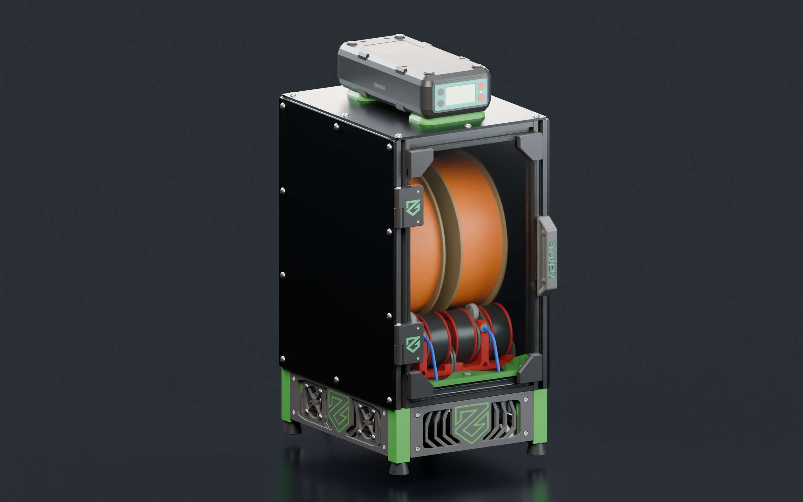
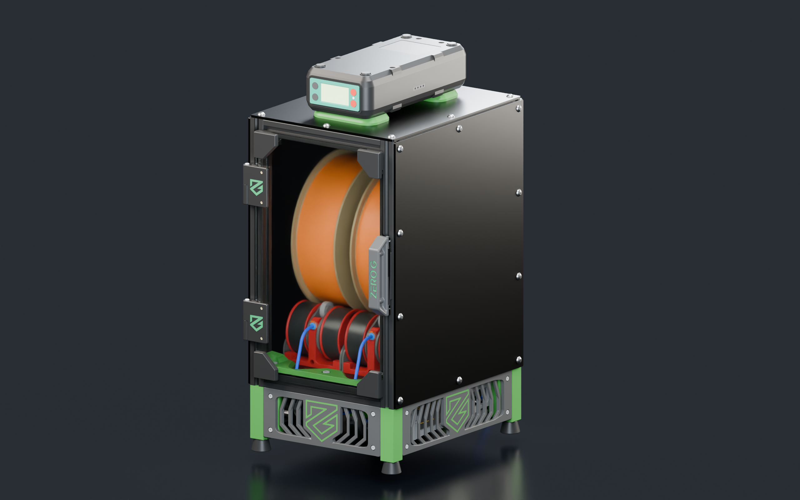
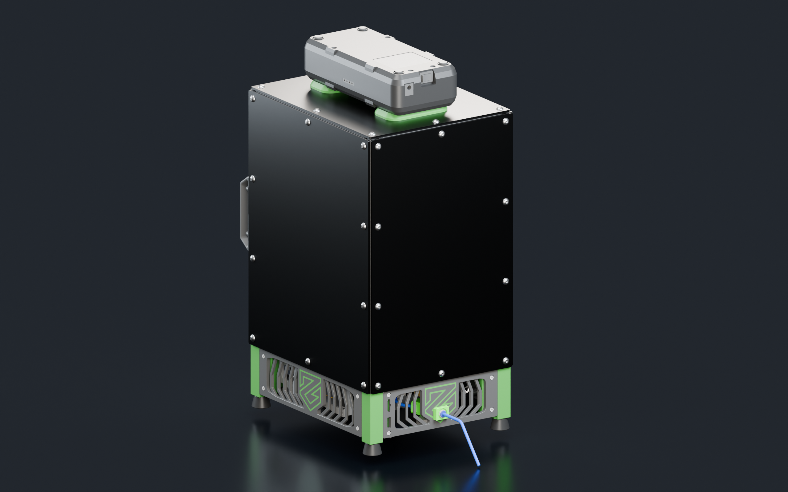
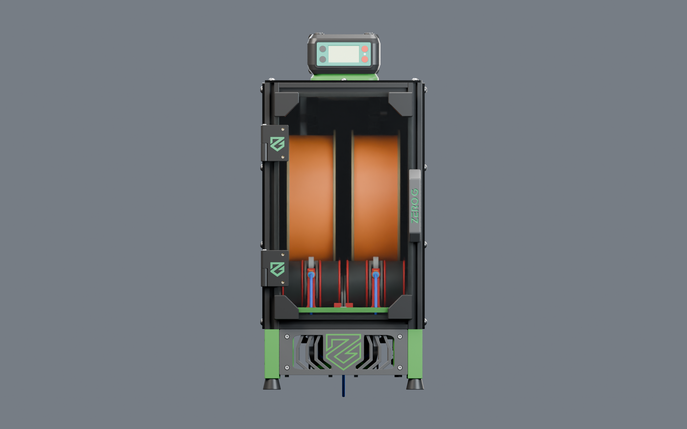
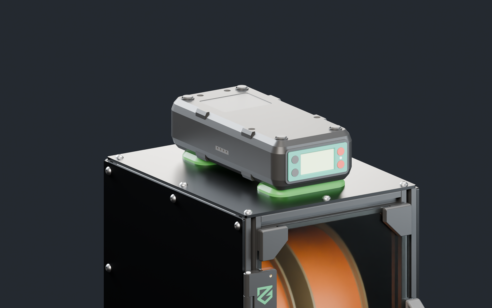
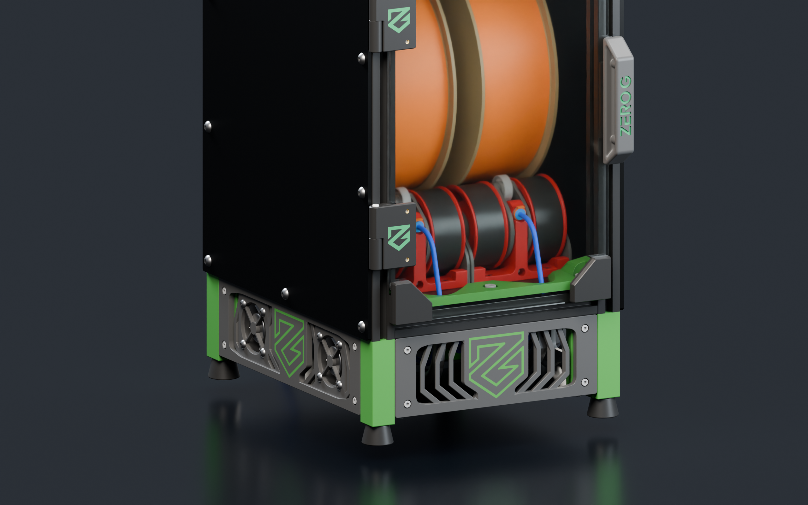

# Noctis — NightOwl Enclosure Mod

A mod of [NightOwl by mjonuschat](https://github.com/mjonuschat/NightOwl), by [FishyFabsPNW](https://github.com/Fishyfabspnw).

Noctis adds an enclosed filament/MMU setup with a panel-and-door enclosure, dryer integration, fans, PTFE guides, and LED mounts.

> **Beta release:** Some parts still need adjustments. Check fit and clearances before building.

## Download

**[Download the complete STEP file](https://github.com/Fishyfabspnw/Noctis-Enclosure-NightOwl-Mod-/releases/download/v0.1.0-beta.1/Noctis-NightOwl-v0.1.0-beta.1.step)** · [Beta release](https://github.com/Fishyfabspnw/Noctis-Enclosure-NightOwl-Mod-/releases/tag/v0.1.0-beta.1)

## Renderings

| Front | Opposite side |
| --- | --- |
|  |  |

| Rear | Front elevation |
| --- | --- |
|  |  |

| Dryer | MMU detail |
| --- | --- |
|  |  |

## Credits

Based on the original [NightOwl](https://github.com/mjonuschat/NightOwl). Noctis is a community mod, not an official NightOwl release.

- [Nebula — ZeroG](https://github.com/ZeroGDesign/Nebula): the door is adapted from Nebula and scaled down to fit Noctis.
- Hartk's [Dual Nightwatch and Bowden Y-Splitter](https://github.com/hartk1213/MISC/tree/main/Voron%20Mods/Extruders/Dual_Nightwatch)
- [Filamentalist Rewinder](https://github.com/Enraged-Rabbit-Community/ERCF_v2/tree/master/Recommended_Options/Filamentalist_Rewinder) — Enraged Rabbit Community
- [MMB controller](https://github.com/bigtreetech/MMB) — BIGTREETECH
- [TurtleNeck](https://github.com/ArmoredTurtle/TurtleNeck) — ArmoredTurtle

NightOwl-derived parts use [GPL-3.0](LICENSE). The adapted ZeroG Nebula door uses [CC BY-NC-SA 4.0](https://github.com/ZeroGDesign/Nebula/blob/Nebula1/LICENSE). Original authors' and third-party notices remain applicable. Noctis modifications by FishyFabsPNW, beta released August 30, 2026.

Earlier project images

